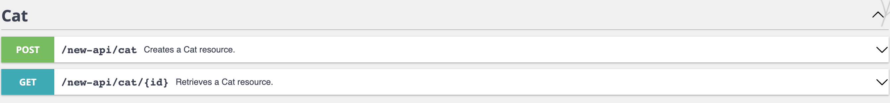

API Module Example
=====================

## About

This example module demonstrates how to modify PrestaShop's new API.

## How to install

1. Download or clone module into `modules` directory of your PrestaShop installation
2. Rename the directory to make sure that module directory is named `api_module`*
3. `cd` into module's directory and run following commands:
   - `composer install` - to download dependencies into vendor folder
4. Install module:
   - from Back Office in Module Manager
   - using the command `php ./bin/console prestashop:module install api_module`

_* Because the name of the directory and the name of the main module file must match._

## License

This module is released under the [Academic Free License 3.0][AFL-3.0] 

[report-issue]: https://github.com/PrestaShop/PrestaShop/issues/new/choose
[AFL-3.0]: https://opensource.org/licenses/AFL-3.0
