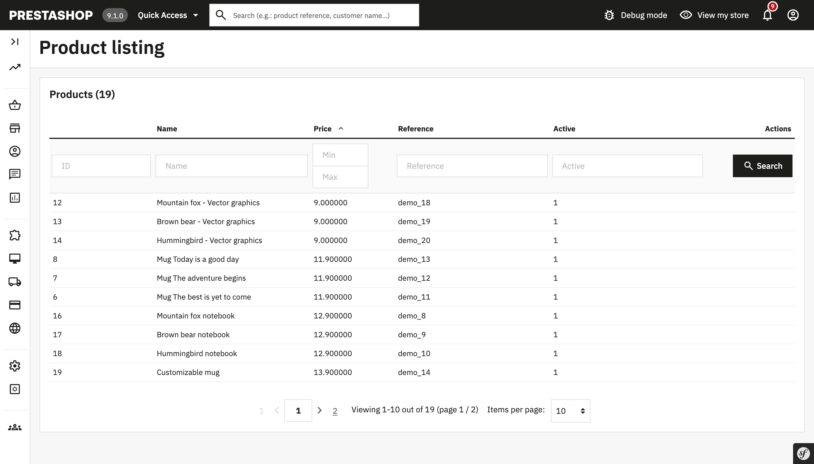

# Module Demo Grid

## About

This module demonstrates how to use Grid in PrestaShop 1.7.7+
Please note this module is an example only, not a mandatory structure.

### Supported PrestaShop versions

PrestaShop 1.7.7 to PrestaShop 8.1.0

### Requirements

 1. Composer, see [Composer](https://getcomposer.org/) to learn more

#### How to install

 1. Download or clone module into `modules` directory of your PrestaShop installation
 2. Rename the directory to make sure that module directory is named `demo_grid`*
 3. `cd` into module's directory and run following commands:
     - `composer install` - to download dependencies into vendor folder
 4. Install module:
  - from Back Office in Module Manager
  - using the command `php ./bin/console prestashop:module install demo_grid`
 5. Now you can see an example grid in the Back Office after opening module's configuration page
_* Because the name of the directory and the name of the main module file must match._
