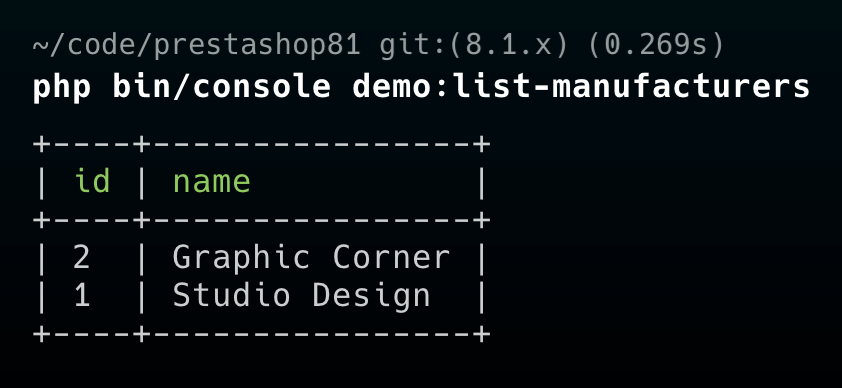

# Module DemoConsoleCommand

## About

Example module showing how to implement Symfony console command. For more info check Symfony docs https://symfony.com/doc/current/console.

### Supported PrestaShop versions

PrestaShop 1.7.7 to PrestaShop 8.1.0

### Requirements

1. Composer, see [Composer](https://getcomposer.org/) to learn more

#### How to install:
1. Copy the module into `modules` directory of your PrestaShop installation
2. `cd` into the module's directory and run `composer install` to download dependencies into vendor directory
3. Install the module from the Back Office

### How to use the module?

Run `php bin/console demo:list-manufacturers` from PrestaShop root directory to see the output
