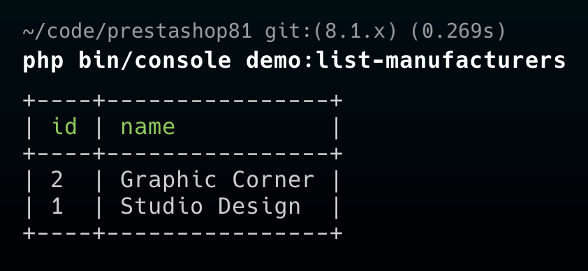

# Module DemoConsoleCommand

## About

Example module showing how to implement Symfony console command. For more info check Symfony docs https://symfony.com/doc/current/console.

### Supported PrestaShop versions

PrestaShop 9.0.0 and later

### Requirements

1. Composer, see [Composer](https://getcomposer.org/) to learn more

## How to install

1. Download or clone module into `modules` directory of your PrestaShop installation
2. Rename the directory to make sure that module directory is named `democonsolecommand`*
3. `cd` into module's directory and run following commands:
   - `composer install` - to download dependencies into vendor folder
4. Install module:
   - from Back Office in Module Manager
   - using the command `php ./bin/console prestashop:module install democonsolecommand`

_* Because the name of the directory and the name of the main module file must match._

### How to use the module?

Run `php bin/console demo:list-manufacturers` from PrestaShop root directory to see the output
