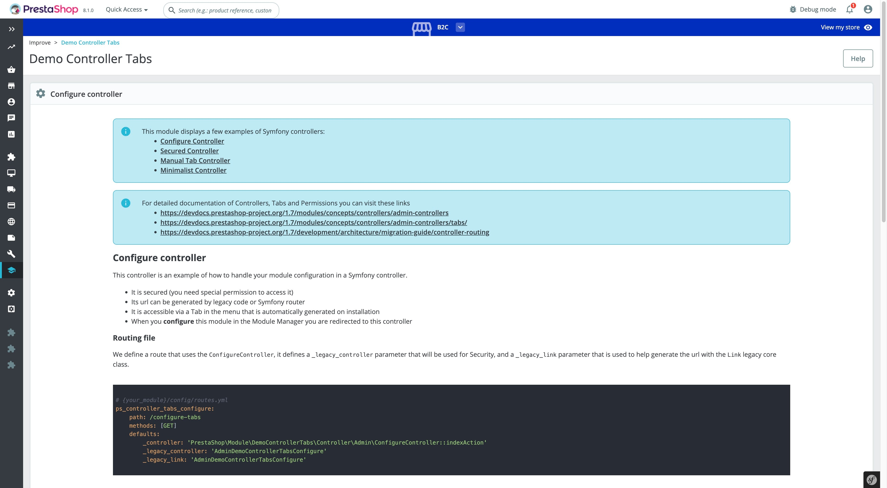

# Demo Controller Tabs

## About

This module demonstrates how to create modern Controllers and associate Tabs, it was designed for test purposes and as an example.

Please note this module is an example only, not a mandatory structure.

 1. Symfony Controller with permission
 2. Symfony Controller without security
 3. Automatic Tab creation
 4. Manual Tab creation
 5. Silent Tab creation for other controllers (not visible)

### Supported PrestaShop versions

PrestaShop 1.7.7 to PrestaShop 8.1.

## Requirements

 1. Composer, see [Composer](https://getcomposer.org/) to learn more

## How to install

1. Download or clone module into `modules` directory of your PrestaShop installation
2. Rename the directory to make sure that module directory is named `democontrollertabs`*
3. `cd` into module's directory and run following commands:
     - `composer install` - to download dependencies into vendor folder
4. Install module:
  - from Back Office in Module Manager
  - using the command `php ./bin/console prestashop:module install democontrollertabs`
5. Open the module configuration page to see the example tabs

*Because the name of the directory and the name of the main module file must match.*

