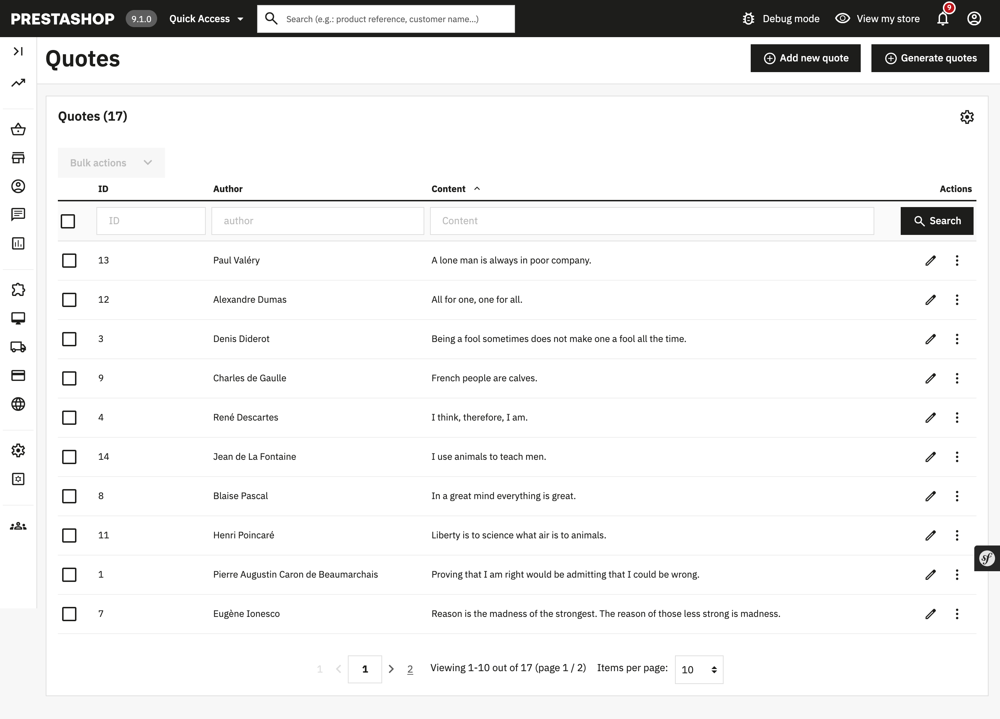

# Demo Doctrine

## About

This module demonstrates how to use Doctrine entities in PrestaShop 1.7.7 and above.

Please note this module is an example only, not a mandatory structure.

### Supported PrestaShop versions

PrestaShop 1.7.7 to PrestaShop 8.1.

## Requirements

 1. Composer, see [Composer](https://getcomposer.org/) to learn more

## How to install

 1. Download or clone module into `modules` directory of your PrestaShop installation
 2. Rename the directory to make sure that module directory is named `demodoctrine`*
 3. `cd` into module's directory and run following commands:
     - `composer install` - to download dependencies into vendor folder
 4. Install module:
  - from Back Office in Module Catalog
  - using the command `php ./bin/console prestashop:module install demodoctrine`

*Because the name of the directory and the name of the main module file must match.*

## Other examples

In this module, we also demonstrated other usecases that you might find useful for building a module. However they are not mandatory to use in your module.

### Using Doctrine ORM to handle persisted models

We used [Doctrine ORM](https://github.com/doctrine/orm) to manage the persistence of multiple models, instead of PrestaShop ObjectModel ORM.
