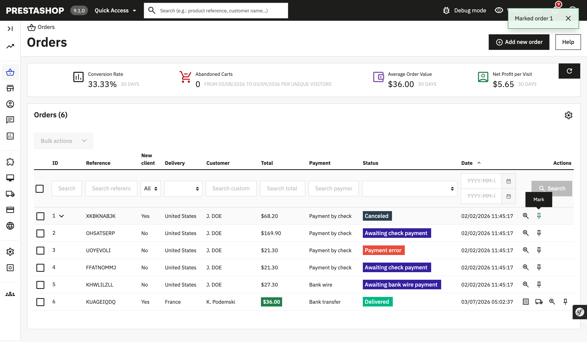

# Demonstration of how to extend grids

## About

This module demonstrates:
 * how to insert an additional row action to existing grid
 * how to register javascript in admin controller

The above items are done to add a small 'mark' action in Back Office Orders listing:

### Supported PrestaShop versions

 This module is compatible with PrestaShop 1.7.7.0 and above versions.
 
### Requirements
 
  1. Composer, see [Composer](https://getcomposer.org/) to learn more
 
### How to install
 
  1. Download or clone module into `modules` directory of your PrestaShop installation
  2. Rename the directory to make sure that module directory is named `demoextendgrid`*
  3. `cd` into module's directory and run following commands:
      - `composer install` - to download dependencies into vendor folder
  4. Install module from Back Office
 
_* Because the name of the directory and the name of the main module file must match._

