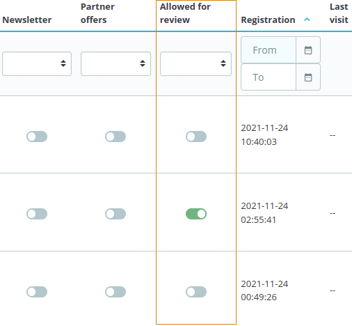
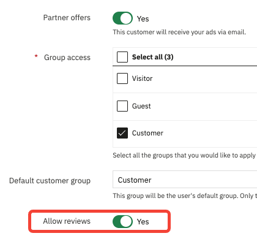

# Demonstration of how to insert an input inside a Symfony form

Learn using identifiable object and grid hooks.

## About

This module adds a new field to Customer: a yes/no field "is allowed to review".
This new field appears:
- in the Customers listing as a new column
- in the Customers Add/Edit form as a new field you can manage

This modules demonstrates
 - how to add this field, manage its content and its
properties using modern hooks in Symfony pages
 - how to use Translator inside modern Symfony module

### Details

This module uses an ObjectModel entity to persist the data submitted by the user.
[Other modules](https://github.com/PrestaShop/example-modules/tree/master/demoextendsymfonyform2) demonstrate
how to use DoctrineORM.

### Supported PrestaShop versions

PrestaShop 1.7.6 to PrestaShop 8.1.
 
### Requirements
 
  1. Composer, see [Composer](https://getcomposer.org/) to learn more
 
### How to install
 
  1. Download or clone module into `modules` directory of your PrestaShop installation
  2. Rename the directory to make sure that module directory is named `demoextendsymfonyform1`*
  3. `cd` into module's directory and run following commands:
      - `composer install` - to download dependencies into vendor folder
  4. Install module from Back Office
 
 *Because the name of the directory and the name of the main module file must match.
