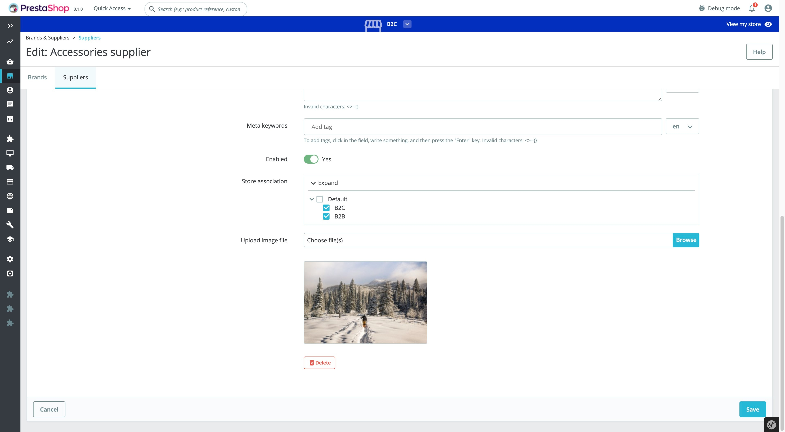

# Demonstration of how to insert an input inside a Symfony form - 2

## About

This module demonstrates:
 * how to insert an "upload image" input field inside the Symfony form managing "Edit a Supplier" page
 * how to use [DoctrineORM](https://www.doctrine-project.org/projects/orm.html) to manage the database state of a custom object

 ### Supported PrestaShop versions

 PrestaShop 1.7.7 to PrestaShop 8.1.
 
 ### Requirements
 
  1. Composer, see [Composer](https://getcomposer.org/) to learn more
 
 ### How to install
 
  1. Download or clone module into `modules` directory of your PrestaShop installation
  2. Rename the directory to make sure that module directory is named `demoextendsymfonyform2`*
  3. `cd` into module's directory and run following commands:
      - `composer install` - to download dependencies into vendor folder
  4. Install module from Back Office
 
 *Because the name of the directory and the name of the main module file must match.
 

