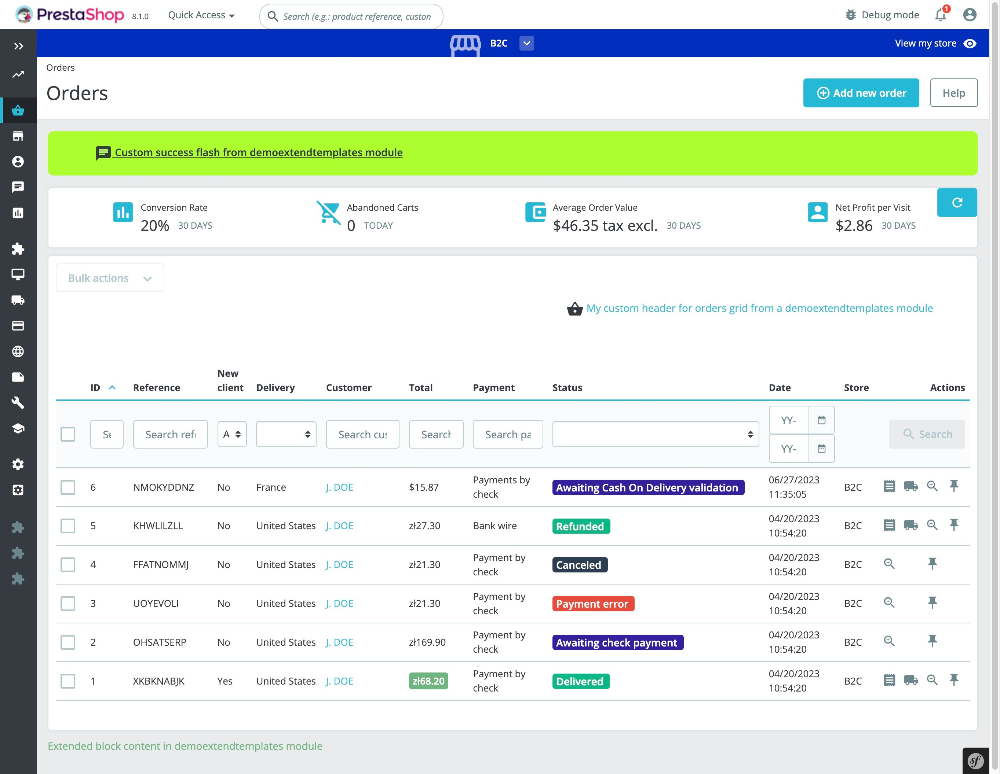

# Module demoextendtemplates

## About

This is example module explaining various extendability options of templates
1. Customize Order page by creating twig template following original order page template path in your module
2. Override twig blocks that are rendered directly in extended page
3. Override twig blocks that are used by including other templates in extended page
4. Add custom flash message type (also includes decoration of controller to show example of custom flash message)
5. Override flash messages html using macro

### Supported PrestaShop versions

Compatible with 8.0.0 and above versions.

### Requirements

1. Composer, see [Composer](https://getcomposer.org/) to learn more

#### How to install:
1. Copy the module into `modules` directory of your PrestaShop installation
2. `cd` into the module's directory and run `composer install` to download dependencies into vendor directory
3. Install the module from Back Office
