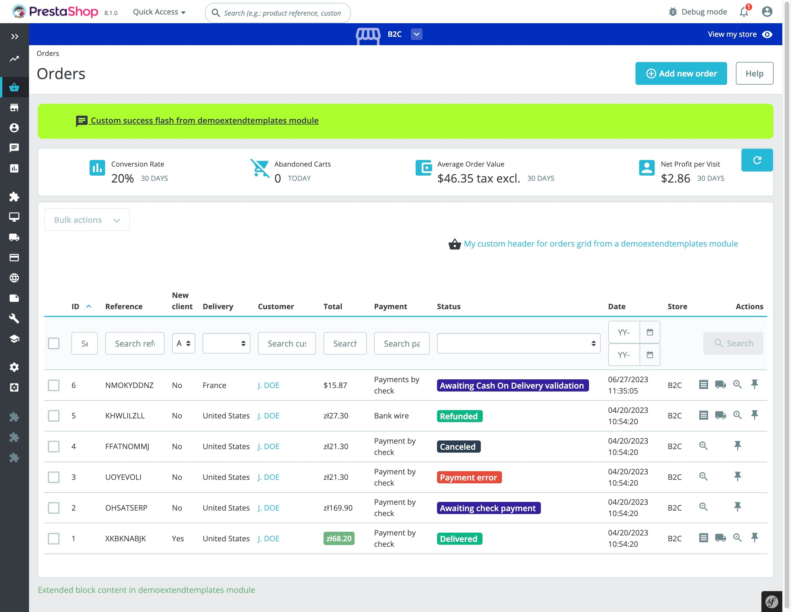

# Module demoextendtemplates

## About

This is example module explaining various extendability options of templates
1. Customize Order page by creating twig template following original order page template path in your module
2. Override twig blocks that are rendered directly in extended page
3. Override twig blocks that are used by including other templates in extended page
4. Add custom flash message type (also includes decoration of controller to show example of custom flash message)
5. Override flash messages html using macro

### Supported PrestaShop versions

Compatible with 9.0.0 and above versions.

### Requirements

1. Composer, see [Composer](https://getcomposer.org/) to learn more

## How to install

1. Download or clone module into `modules` directory of your PrestaShop installation
2. Rename the directory to make sure that module directory is named `demoextendtemplates`*
3. `cd` into module's directory and run following commands:
   - `composer install` - to download dependencies into vendor folder
4. Install module:
   - from Back Office in Module Manager
   - using the command `php ./bin/console prestashop:module install demoextendtemplates`

_* Because the name of the directory and the name of the main module file must match._
