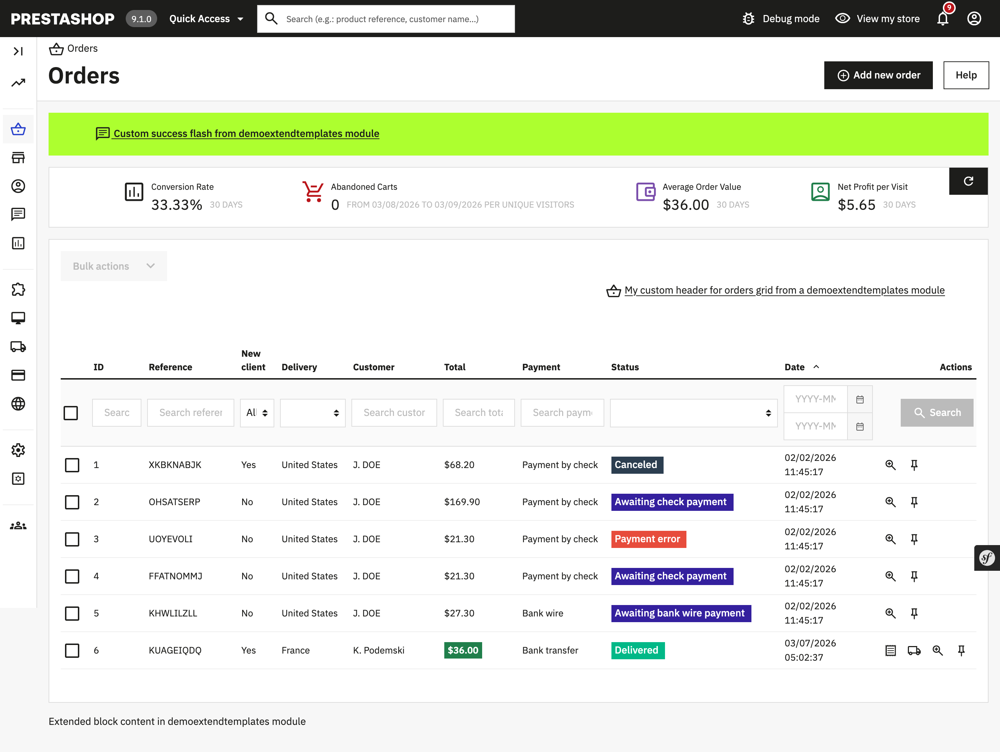

# Module demoextendtemplates

## About

This is example module explaining various extendability options of templates
1. Customize Order page by creating twig template following original order page template path in your module
2. Override twig blocks that are rendered directly in extended page
3. Override twig blocks that are used by including other templates in extended page
4. Add custom flash message type (also includes decoration of controller to show example of custom flash message)
5. Override flash messages html using macro

### Supported PrestaShop versions

Compatible with 9.1.0 and above versions.

### Requirements

1. Composer, see [Composer](https://getcomposer.org/) to learn more

## How to install

1. Download or clone module into `modules` directory of your PrestaShop installation
2. Rename the directory to make sure that module directory is named `demoextendtemplates`*
3. `cd` into module's directory and run following commands:
   - `composer install` - to download dependencies into vendor folder
4. Install module:
   - from Back Office in Module Manager
   - using the command `php ./bin/console prestashop:module install demoextendtemplates`

_* Because the name of the directory and the name of the main module file must match._

## A word about decorating controllers

Decorating controllers is a powerful way to extend or modify the behavior of existing controllers without altering their original code. This approach allows you to add new features, modify existing ones, or even change the way data is processed and displayed. In this module, we demonstrate how to decorate the OrderController to add a custom flash message type and display it on the order page. By using Symfony's dependency injection and decoration features, we can seamlessly integrate our custom logic while maintaining compatibility with future updates of PrestaShop.

Of course, there are some downsides to this approach, such as potential conflicts with other modules that also decorate the same controller, and the need to ensure that your decorations are compatible with future updates of the original controller. However, when used judiciously, decorating controllers can be an effective way to extend functionality while keeping your code organized and maintainable.

**Alternatives**?

You can base on EventSubscriber and listen to KernelEvents::CONTROLLER event, check if the controller and action match the one you want to extend, and execute your code before or after the controller's action is executed. This approach is more decoupled and can be easier to maintain, but it has some limitations compared to decorating the controller directly. Here are a few real ones worth knowing:                                                                     
                                         
1. You can't modify what the controller returns                                                         
With the subscriber you intercept before or replace entirely. If you want to take the controller's      
response and mutate it (e.g. add extra data to a JSON response, or inject a Twig variable), you'd need  
KernelEvents::RESPONSE instead — and at that point parsing/modifying an already-rendered response is
painful. The decorator gives you full control around the call: before, after, and the return value.

2. You're coupled to the method name as a string
'deleteProductAction' is a magic string. If the core renames the method, nothing breaks at compile time
— it silently stops working. The decorator would cause an immediate PHP fatal error, which is actually
better for catching regressions early.

3. No access to the controller's injected arguments
By the time your subscriber runs, Symfony hasn't resolved the action arguments yet (the #[Autowire]
services, etc.). You can read route attributes from the request, but you can't intercept and modify what
gets passed into the controller. The decorator has those arguments right in the method signature.

4. Fires on every single request
KernelEvents::CONTROLLER runs on every HTTP request, including sub-requests. The is_array($controller)
and instanceof checks are cheap, but it's worth being aware of — especially if you add many actions to
the match.

Bottom line: the subscriber is the right tool when you want to block or prepend simple side effects
(logging, flash messages, access checks). The decorator is still the right tool when you need to wrap
the controller's output or modify its inputs. They're complementary, not mutually exclusive.
