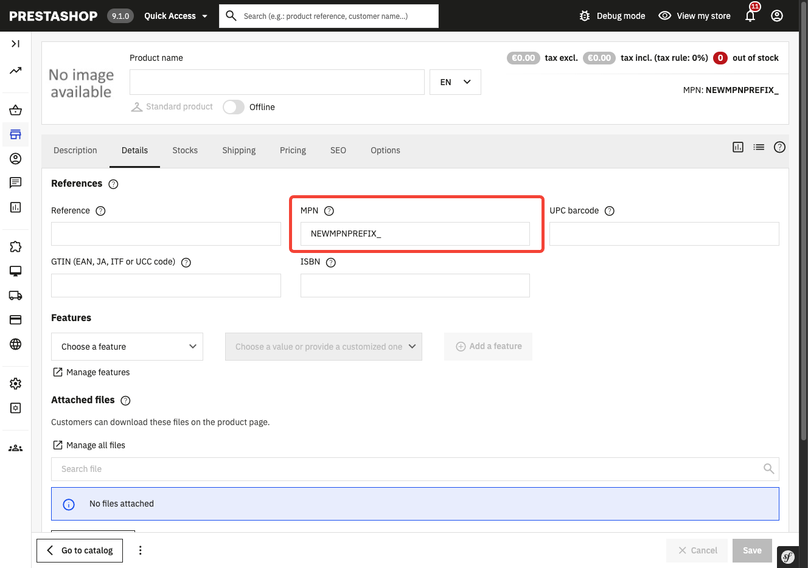

# Demo Form Data Providers

## About

This module demonstrates how to use form data provider hooks to intercept and modify data loaded into a PrestaShop admin form.

It hooks into the Product form and automatically adds a prefix (`NEWMPNPREFIX_`) to the MPN (Manufacturer Part Number) field found under **Details > References > MPN**:

- `actionProductFormDataProviderDefaultData` — sets the prefix as the default MPN value when creating a new product.
- `actionProductFormDataProviderData` — prepends the prefix to the existing MPN value when editing a product, if the prefix is not already present.

These hooks follow the `action[FormName]FormDataProvider[Data|DefaultData]` naming convention and allow modules to read and modify form data before it is rendered, without overriding core classes.

### Supported PrestaShop versions

PrestaShop 8.0.0 and later.

## How to install

1. Download or clone module into `modules` directory of your PrestaShop installation
2. Rename the directory to make sure that module directory is named `demoformdataproviders`*
3. Install module:
   - from Back Office in Module Manager
   - using the command `php ./bin/console prestashop:module install demoformdataproviders`

_* Because the name of the directory and the name of the main module file must match._

### How to test

1. Go to **Catalog > Products** in the Back Office and create a new product.
2. Open the **Details** tab and check the **References > MPN** field — it should be pre-filled with `NEWMPNPREFIX_`.
3. Save the product and re-open it — the MPN value should still be prefixed with `NEWMPNPREFIX_`.
4. Manually set an MPN without the prefix, save, and re-open — the prefix should be added automatically.
