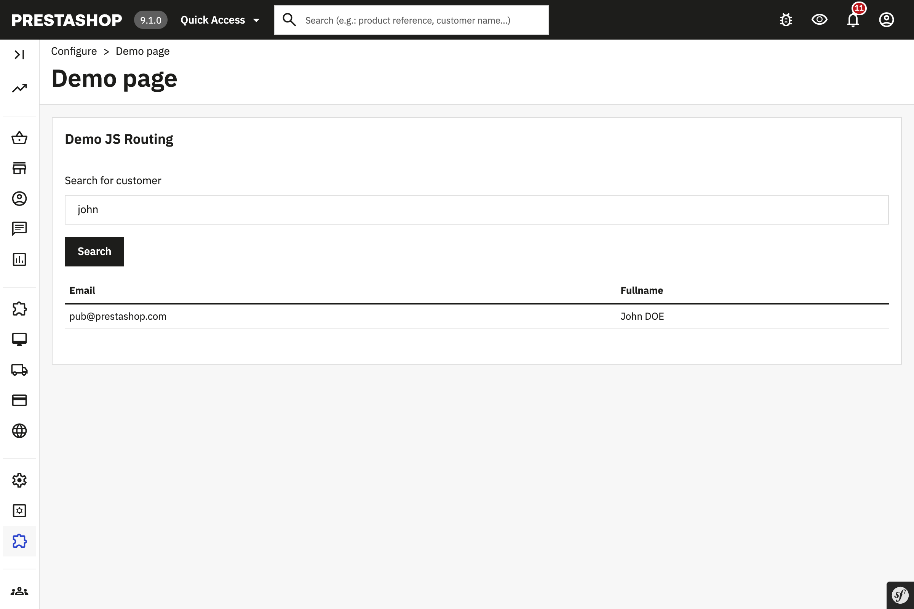

# Demo js routing

## About

This module illustrates how to use Javascript Router [component](https://devdocs.prestashop.com/1.7/development/components/global-components/) in a module

It provides a demo page which relies on the Router to allow customers search in PS 1.7.8+. It provides an alternative way when the Router is unavailable in PS 1.7.7 also :)

### Requirements

1. Composer, see [Composer](https://getcomposer.org/) to learn more

### Supported PrestaShop versions

Compatible with 1.7.7.0 and above versions.

#### How to install:
1. Copy the module into `modules` directory of your PrestaShop installation
2. `cd` into the module's directory and run `composer install` to download dependencies into vendor directory
3. Install the module from Back Office
