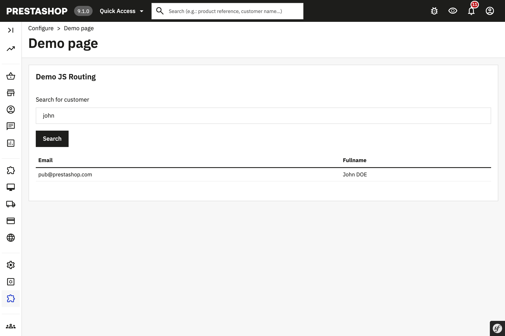

# Demo js routing

## About

This module illustrates how to use Javascript Router [component](https://devdocs.prestashop-project.org/9/development/components/global-components/) in a module

It provides a demo page which relies on the Router to allow customers search.

### Requirements

1. Composer, see [Composer](https://getcomposer.org/) to learn more

### Supported PrestaShop versions

Compatible with 9.0.0 and above versions.

## How to install

1. Download or clone module into `modules` directory of your PrestaShop installation
2. Rename the directory to make sure that module directory is named `demojsrouting`*
3. `cd` into module's directory and run following commands:
   - `composer install` - to download dependencies into vendor folder
4. Install module:
   - from Back Office in Module Manager
   - using the command `php ./bin/console prestashop:module install demojsrouting`

_* Because the name of the directory and the name of the main module file must match._
