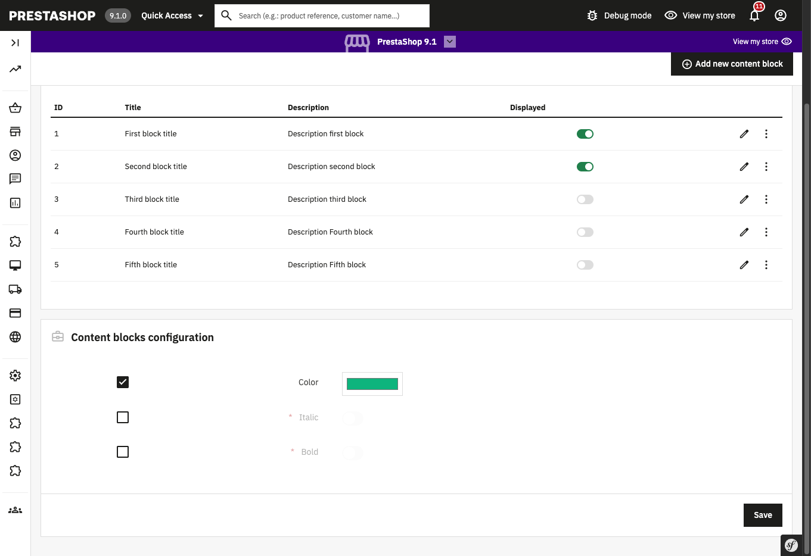

## Demo Multistore Form

## About

The goal of this module is to help developers to make their modules compatible with the multistore feature. You can find in this module all the multistore features that you should implement in your modules if you want to make them compatible with the multistore feature, starting from 1.7.8.0.

This module demonstrates how to make your forms multistore compatible in your module, in a CRUD context, it includes:

- A listing of elements using Prestashop's [grid component](https://devdocs.prestashop-project.org/1.7/development/components/grid/)
- A create/edit form, using [doctrine](https://devdocs.prestashop-project.org/1.7/modules/concepts/doctrine/) and a shop association block, via Prestashop's [ShopChoiceTreeType](https://devdocs.prestashop-project.org/1.7/development/components/form/types-reference/shop-choice-tree/)
- A multistore compatible form with multistore checkboxes and dropdowns, using Prestashop's [multistore form extension](https://devdocs.prestashop-project.org/1.7/development/multistore/configuration-forms/)
- A fixtures generation mechanism, using [doctrine](https://devdocs.prestashop-project.org/1.7/modules/concepts/doctrine/)
- Displaying the configured blocks on Front Office

### Multistore features

#### The shop association block 

You should display it as soon as the user wishes to add an element. It allows him to choose with which store(s) he wants to add the element.

#### Listing

The elements displayed in the listing depend on the store selected in the context.

If the selected context is 'all shops', all elements of all the shops are displayed. 

#### Checkboxes

The user should be able to apply a specific configuration for a specific shop or group. This is implemented by checkboxes that are added before each element when a specific shop context or a group is selected as context.

#### Specific settings drop-down

The user should be able to see which parameters have a specific configuration for a shop or a group when he is in the 'all shops' context. The parameter(s) configured specifically for a shop or a group is/are not impacted by changes done in the 'all shops' context.

This information helps the user know, when using the 'all shops' context, whether the changes he is doing will be applied. This is implemented with specific settings drop-down that are added, in the 'all shops' context and in group context.
 
#### Enable / disable from the listing

The enable / disable action made from the listing enable/disable the element for all the stores with which it’s associated and not only for the context selected.

#### Delete from the listing

If an element is associated with several shops, then a user deletes it from the listing, it will be dissociated from the selected context(s) and deleted if it is no longer associated with any store.

 ### Supported PrestaShop versions

 This module is compatible with PrestaShop 1.7.8 to PrestaShop 8.1.

 ### Requirements

  1. Composer, see [Composer](https://getcomposer.org/) to learn more

 ### How to install

  1. Download or clone module into `modules` directory of your PrestaShop installation
  2. Rename the directory to make sure that the module directory is named `demomultistoreform`*
  3. `cd` into module's directory and run following commands:
      - `composer install` - to download dependencies into the vendor folder
  4. Install module from Back Office
  5. In the BO, activate multistore in Shop parameters > Preferences
  6. Create and configure at least one second shop

 _* Because the name of the directory and the name of the main module file must match._
