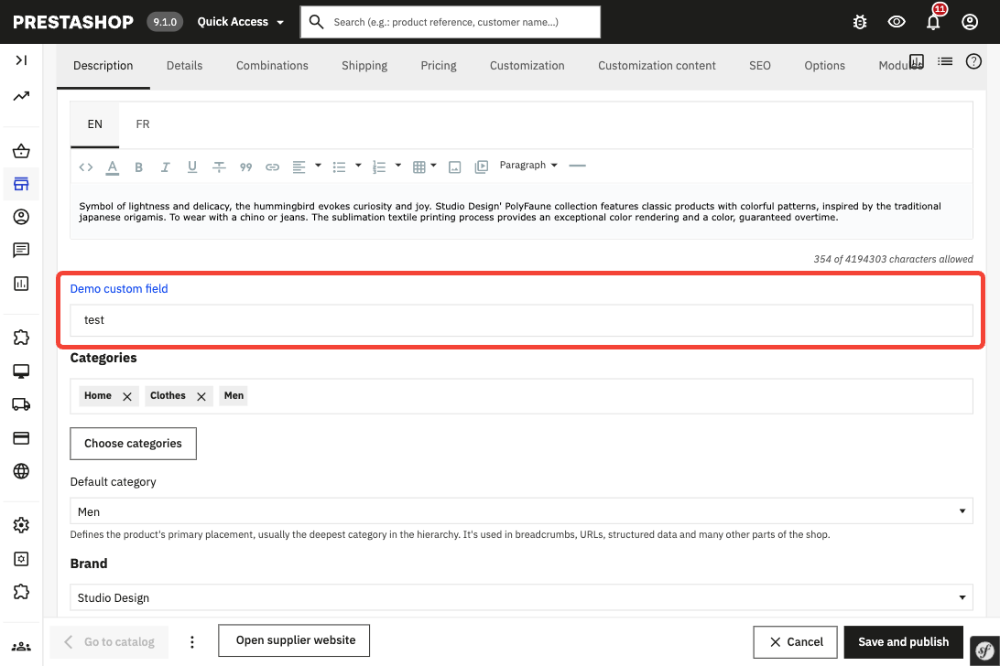
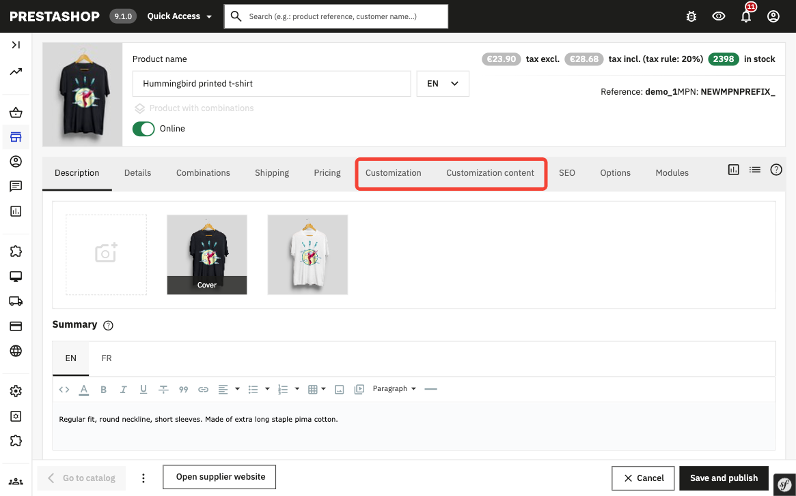
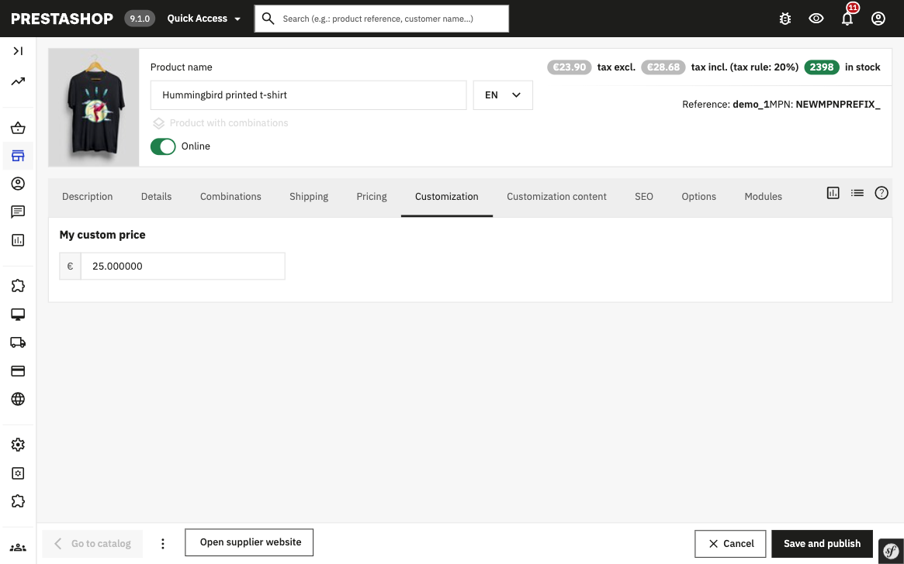
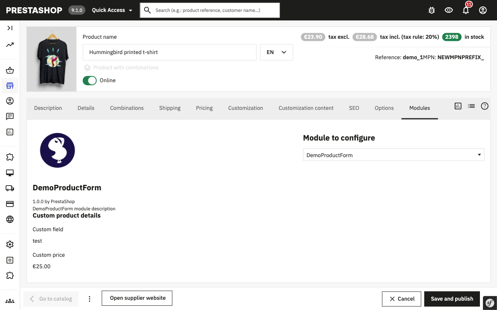

# Module demoproductform

## About

This module demonstrates various ways to extend the product page form in the Back Office (PrestaShop 9.0.0+).

### What it adds to the product form

**Description tab**
- A **Demo custom field** text input added after the built-in description field.

**Customization tab** (new tab inserted after Pricing)
- A **My custom price** money field stored alongside the product.

**Custom tab content tab** (inserted after the Customization tab)
- A second custom tab demonstrating how to add another tab using a separate form type.

**Footer**
- An **Open supplier website** link button added to the product form footer.

**Modules tab** (`displayAdminProductsExtra` hook)
- Renders a Twig template showing the stored custom product data — demonstrates using `displayAdminProductsExtra` to add read-only information to the dedicated Modules tab.

### What it adds to the combination form

When a product has combinations, the module also extends the combination edit form:

- A **Demo custom field** text input added after the References section.
- A **Customization** tab with a **My custom price** money field, inserted after the Price impact section.

### Key patterns demonstrated

1. **`actionProductFormBuilderModifier`** — modifying the product form structure using `FormBuilderModifier` (adding fields and full tabs).
2. **`actionCombinationFormFormBuilderModifier`** — same pattern applied to the combination form.
3. **`ProductCommandsBuilderInterface`** — using `CustomProductCommandsBuilder` (tagged as `core.product_command_builder`) to dispatch a CQRS command when the product form is saved. This is the recommended approach specific to the product page.
4. **`actionAfterUpdateCombinationFormFormHandler`** — saving combination custom data via an identifiable object hook.
5. **Dedicated ObjectModel entities** — `CustomProduct` and `CustomCombination` persist data in their own tables (`demoproductform_custom_product`, `demoproductform_custom_combination`) without touching core tables.
6. **Modern translation system** — using `isUsingNewTranslationSystem()`.

### Supported PrestaShop versions

Compatible with 9.0.0 and above versions.

### Requirements

1. Composer, see [Composer](https://getcomposer.org/) to learn more

## How to install

1. Download or clone module into `modules` directory of your PrestaShop installation
2. Rename the directory to make sure that module directory is named `demoproductform`*
3. `cd` into module's directory and run following commands:
   - `composer install` - to download dependencies into vendor folder
4. Install module:
   - from Back Office in Module Manager
   - using the command `php ./bin/console prestashop:module install demoproductform`

_* Because the name of the directory and the name of the main module file must match._
