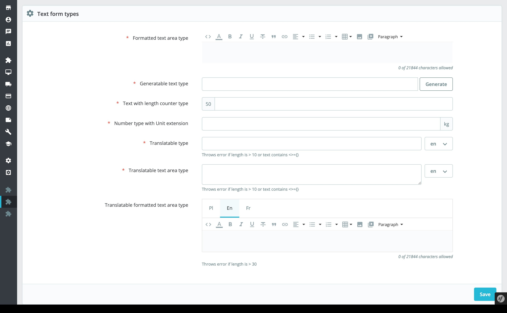

# Demonstration of how to use PrestaShop Symfony form types

## About

This module demonstrates how to use existing PrestaShop Symfony form types inside a new page.

It provides two demo pages where all possible [form types](https://symfony.com/doc/current/reference/forms/types.html)
are being used. You can use these pages as examples of how to integrate these inputs in a module.

### Supported PrestaShop versions

This module is compatible with PS 8.0.x versions only.
 
### Requirements
 
1. Composer, see [Composer](https://getcomposer.org/) to learn more
 
### How to install
 
1. Download or clone module into `modules` directory of your PrestaShop installation
2. Rename the directory to make sure that module directory is named `demosymfonyform`*
3. `cd` into module's directory and run following commands:
  - `composer install` - to download dependencies into vendor folder
4. Install module from Back Office
 
_* Because the name of the directory and the name of the main module file must match._
 

