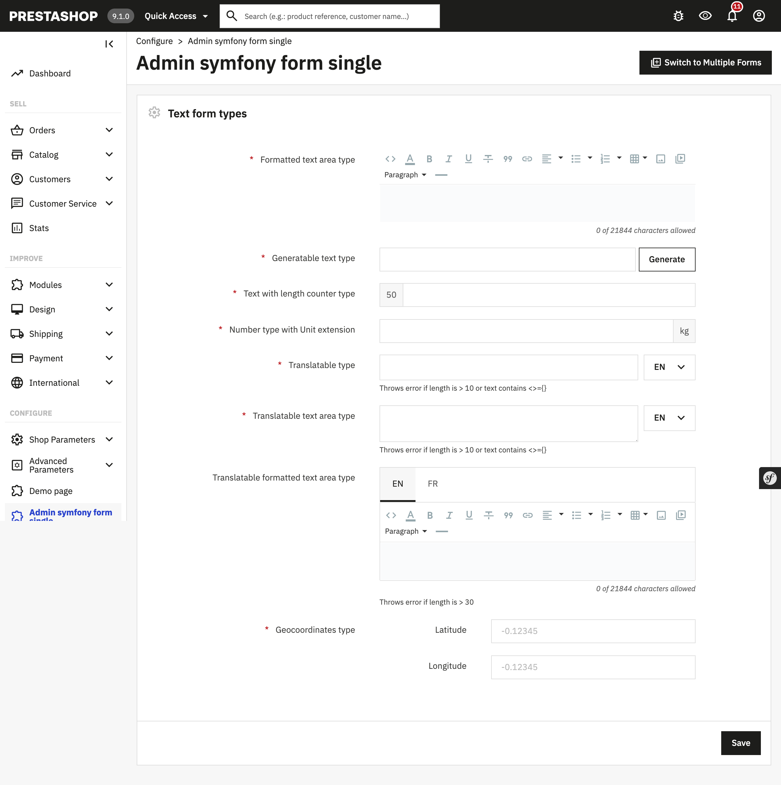

# Demonstration of how to use PrestaShop Symfony form types

## About

This module demonstrates how to use existing PrestaShop Symfony form types inside a new page.

It provides two demo pages where all possible [form types](https://symfony.com/doc/6.4/reference/forms/types.html)
are being used. You can use these pages as examples of how to integrate these inputs in a module.

## Why Symfony forms instead of HelperForm?

If you are coming from older PrestaShop modules, you may be used to `HelperForm` — a PrestaShop-specific helper that lets you define a form with a PHP array and render it with a single method call. It is quick to get started with, but it has hard limits that become painful as a module grows.

Symfony forms require more files and more initial setup. That is a real cost, and it is worth being honest about it. But the architecture pays off:

**Type safety and validation in one place.** A Symfony form type defines both the shape of the data and its validation constraints. With `HelperForm` you validate manually, usually in the controller, and it is easy for the two to fall out of sync.

**Reusability.** A form type is a class. You can extend it, decorate it, or compose it from smaller types. `HelperForm` definitions are plain arrays — you copy-paste them.

**Theme independence.** Symfony forms render through Twig form themes. You can change how every `TextType` or `SwitchType` looks across your entire module by editing one template, without touching the form definition.

**PrestaShop UI Kit out of the box.** PrestaShop ships its own form types (`SwitchType`, `TranslatableType`, `CategoryChoiceTreeType`, and many more) that are built on top of Symfony's type system. They render correctly in the Back Office UI Kit automatically. Reproducing this with `HelperForm` requires manual HTML.

**Extensibility by other modules.** Symfony forms can be modified by other modules via `actionXxxFormBuilderModifier` hooks.

**Testability.** Form types are plain PHP classes with no global state. You can unit-test validation logic, default values, and transformers without booting PrestaShop.

### When HelperForm is still fine

For a simple configuration page with two or three fields that will never be extended by other modules, `HelperForm` is a perfectly reasonable choice. The extra structure of Symfony forms only starts to pay off when the form is complex, needs to be reused, or needs to be extensible.

### Supported PrestaShop versions

This module is compatible with PS >= 9.0 versions only.
 
### Requirements
 
1. Composer, see [Composer](https://getcomposer.org/) to learn more
 
### How to install
 
1. Download or clone module into `modules` directory of your PrestaShop installation
2. Rename the directory to make sure that module directory is named `demosymfonyform`*
3. `cd` into module's directory and run following commands:
  - `composer install` - to download dependencies into vendor folder
4. Install module:
   - from Back Office in Module Manager
   - using the command `php ./bin/console prestashop:module install demosymfonyform`

_* Because the name of the directory and the name of the main module file must match._
