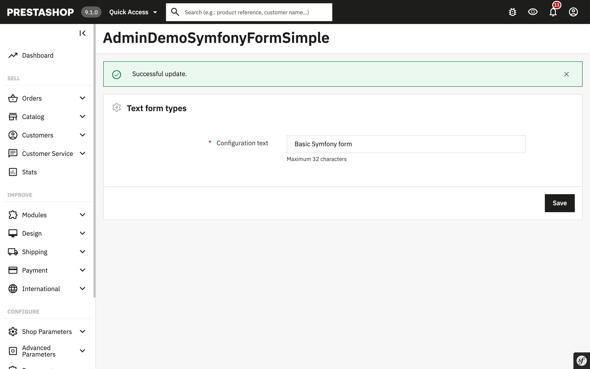

# Demonstration of how to use Symfony form types for Module configuration pages

## About

In this module, you will learn how to utilize Symfony form types to create configuration pages for your module.

[This module has been created by following a guide from the developer documentation](https://devdocs.prestashop-project.org/9/modules/creation/adding-configuration-page-modern/).

It provides a simple configuration page for a module with a Text Field. This text field value is stored [using the Configuration component](https://devdocs.prestashop-project.org/9/development/components/configuration/).

## Supported PrestaShop versions

This module has been tested with PrestaShop 9.

## Requirements

Composer

## How to install

1. Download or clone module into `modules` directory of your PrestaShop installation
2. Rename the directory to make sure that module directory is named `demosymfonyformsimple`*
3. `cd` into module's directory and run following commands:
   - `composer install` - to download dependencies into vendor folder
4. Install module:
   - from Back Office in Module Manager
   - using the command `php ./bin/console prestashop:module install demosymfonyformsimple`

_* Because the name of the directory and the name of the main module file must match._
